## Getting Started on GitHub (Create a Repository, Clone, Commit, Push)

In this section we will learn about the basics of Git and GitHub. We will learn how to create a repository on GitHub, how to clone the repository to a computer, how to modify and update a repository, and how to explore GitHub's version control system.

You should have already created an account on GitHub ([see main readme](readme.MD)).

1. The first step is to create a **repository**. A repository is like a "project folder", the directory where all the files related to the project are stored. The online repository - a la GitHub - is the online copy of this folder.

	**Click the + sign in the top right of the page (blue box), then click new repository:**
  
	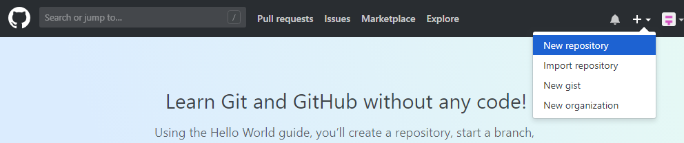

2. Create a new repository on this next screen by specifying a name and description. Repositories on GitHub are stored PER USER, so you don't have to worry about creating a unique repository name.  

	**Create the new repository WITH a README:**

	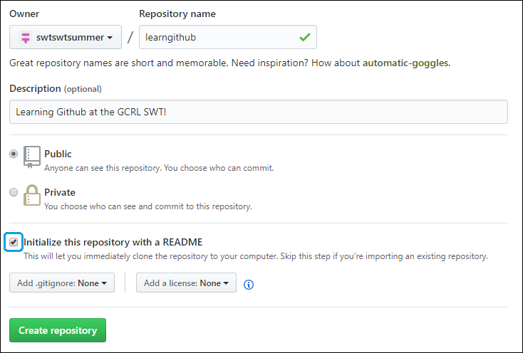

	Your repository should be created! You will be redirected to a page that has instructions, but we will take a different approach that will facilitate learning.

3.  Next we will clone the created project (the README.md file) to your computer. Cloning will create a folder with the name of the GitHub project which will contain the files in the project.  

	For example, if you clone directly to your hard drive directory `C:/`, it will clone all files in the project to the directory `C:/learngithub/`.

	**Navigate to the directory you want to contain the project folder, right click in the folder, and click *"Git Bash Here"***:

	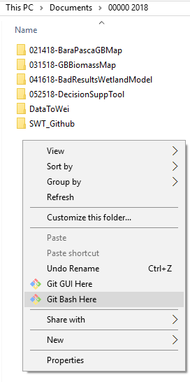

4. You will now see a "Bash Terminal". This is the terminal included with Git, but you can use any. If you find the font size too small, click here for instructions on adjusting size.

	All git commands start with `git` and are followed by the command. Here is a list of commonly used commands:  
	--Table--

	**Type `git status` to see if the current directory is a git repository (it shouldn't be):**

	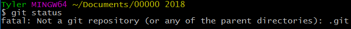

5. It's time to clone! Your project is located at the URL: `https://github.com/[username]/[repository-name]`, and the Git project information can be found at `https://github.com/[username]/[repository-name].git`.

	**Type `git clone https://github.com/[username]/[repository-name].git` to clone your GitHub repository:**

	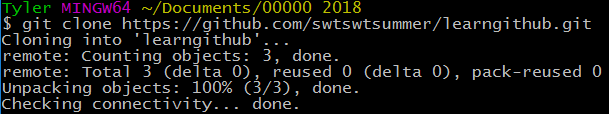

	You will now see the newly cloned project folder, containing the README.md file that was included in your project creation:

	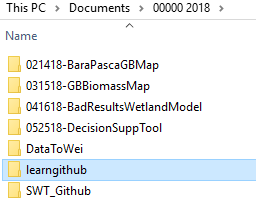

6. Time to verify that the folder is a git repository with our `git status` command from before.

	**Go into the folder by typing `cd [repository-name]` and type `git status`:**

	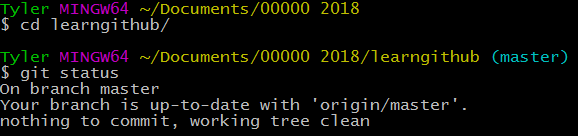

7. Now it's time to modify that README.md file, and update GitHub with the newest version. 

	**Right click README.md, hover over "Open with", and select "Notepad"**:

	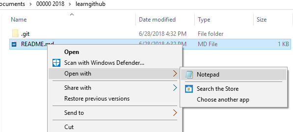

7. README.md is a Markdown file. More information on Markdown files can be found in a [previous SWT lesson](https://sites.google.com/view/gcrl-swt/rmarkdown).	Right now, it only contains the pre-generated information, but let's update it to be more descriptive:

	* **Edit the title (the line that begins with #)**
	* **Add some text to the file**
	
8. Let's check `git status` to see how these edits changed the status of the repository.

	**Type `git status` again:**

	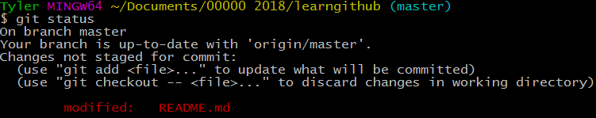

	You will see now that it is telling you that README.md has been modified, but "changes not staged for commit".
9. A **commit** is a record of changes to the repository. We **stage** - or add - files to a commit, then associate a message about the changes. The previous `git status` tells us that git is picking up on changes in the README.md file, but it hasn't been staged (added) to the current commit.

	We add files to commits by typing `git add [file-name.ext]`. See the above table for more examples on how to add all changed files.

	**Add README.md to the current commit by typing `git add README.md`, and then `git status` to see if it's added:**

	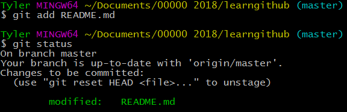

	Now it's time to commit the staged (added) changes. This is done via `git commit -m "[message]"`. [Git standards](https://git.kernel.org/pub/scm/git/git.git/tree/Documentation/SubmittingPatches?id=HEAD#n133) suggest each commit should describe one functional change to the project at a time. This makes it easier to rollback small incremental changes. You associate a message with each commit that describes the change. Standards suggest using present-tense (e.g. Add detail to README; Remove big files; Change addition function)

	**Commit changes with `git commit -m "Add detail to README"`**

	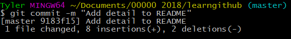

10. The changed README.md is now ready to send to GitHub via a **push**!

	**Push these changes to Github using `git push`:**

	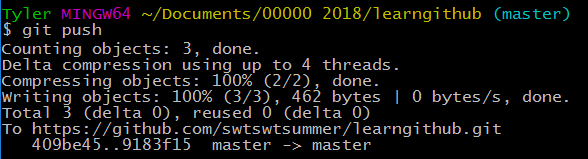

11. We can now view the changes on GitHub! Navigate to your project at URL: `https://github.com/[username]/[repository-name]`

	You will see that the commit count (blue box) is now up to 2 - the initial commit, and the one you just made. You will also see the most recent time the files were edited (red box).

	**Click on the Commits section in the blue box:**
	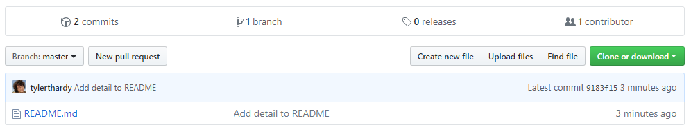

12. On the commits page, you will see the commits made to the project. Again, this is the initial commit when the project was created, and the commit you just made where you updated the README.

	You can click on each commit to see the line-by-line changes that were made in each commit (for binary files i.e. code, simple text, markdown).

	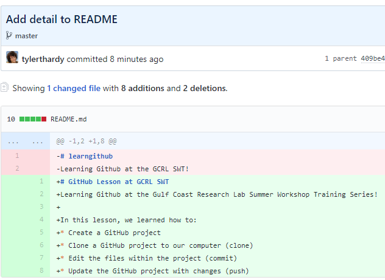

13. Congrats, you made and updated your first GitHub repository!
