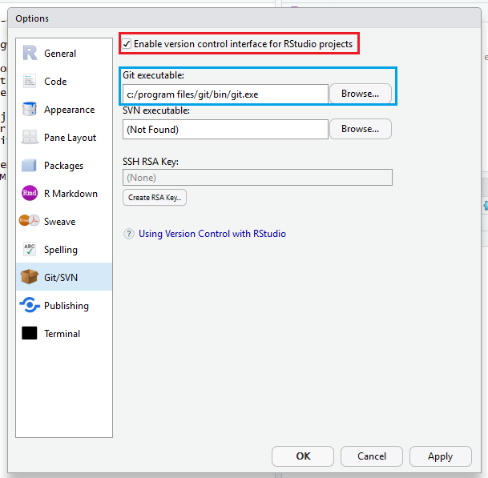
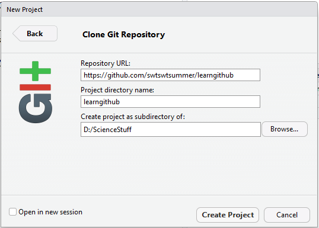

## RStudio Integration
To some, the command line approach to Git is cumbersome, especially when working in an IDE like RStudio. Luckily, many IDEs have integrated version control including Git.

RStudio has Git support built in to RStudio with a graphical interface for the more complicated Git commands.

More information can be [found here](https://support.rstudio.com/hc/en-us/articles/200532077?version=1.1.383&mode=desktop).

In this lesson we will:

1. Set up Git with RStudio
2. Clone a RStudio project from GitHub
3. Stage/commit/push in RStudio

### Enabling Git in RStudio
1. In the menu bar, go to **Tools > Global Options**
2. Click the Git/SVN tab on the left hand side, and check **Enable version control interface for RStudio projects** (red box):
  
	

	*If the blue box does not have any text, click browse and find where you installed Git.*

### Cloning an RStudio project 

Only pre-existing GitHub repositories can be imported into an RStudio project. There is no way to create a GitHub repository in RStudio. Thus, an existing project that is not on GitHub must be put there first by following the instructions in [Lesson 1](lesson1.MD).

Here we will import an existing GitHub repository as an RStudio project.

1. In the menu bar, go to **File > New Project**
2. Select the 3rd option, **Version Control**
3. Select the 1st option, **Git (Clone a project from a Git repository**
4. On the final screen, **write the URL to your GitHub project in the first field** (repository URL) to autofill the remaining fields. You can select a directory in the 3rd field.
 
	**Click *Create Project* at the bottom to finish the cloning process.**
  
	

	If you're continuing from the Lesson 1, try using the URL from the project you created in Project one. The next step assumes you've done this, otherwise you should be completed after this step.

	Your project should now be cloned, and opened in RStudio as any other project would.

### Staging, Committing, and Pushing in RStudio

